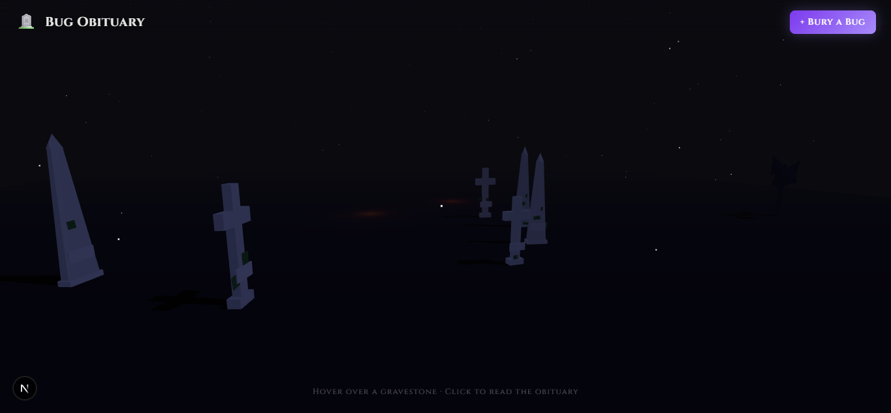

# 🪦 Bug Obituary

> *A graveyard for bugs that have been slain.*

**Bug Obituary** is a full-stack portfolio project where developers can give their fixed bugs the dramatic sendoff they deserve. Submit a bug, and an AI will generate a theatrical, ironic obituary — complete with cause of death, legacy, and an epitaph. Each bug becomes a gravestone in an immersive 3D graveyard you can freely explore.

[](https://github.com/joaoricardofp/bug-obituary.git)
[](https://vercel.com)
[](https://nextjs.org)
[](LICENSE)

---

## 📸 Screenshots



---

## ✨ Features

- **AI-Generated Obituaries** — Powered by Groq's `llama-3.3-70b-versatile` model. Each bug gets a uniquely dramatic, darkly humorous obituary written in seconds.
- **Immersive 3D Graveyard** — Built with Three.js (r128). Cel-shaded gravestones, exponential fog, moonlight, and a full Tim Burton-inspired atmosphere.
- **Three Gravestone Types** — Classic arch, cross, and obelisk — each with weathering details like moss patches, cracks, and name plates, all built from primitives.
- **Free Navigation** — Orbit Controls let you drag, zoom, and pan freely around the graveyard.
- **Interactive Hover & Modal** — Hover over a gravestone to see the bug's name and death date. Click for the full obituary in a cinematic modal.
- **Persistent Storage** — Bugs are stored in Upstash Redis, surviving deploys and server restarts.
- **Framer Motion Animations** — Card flips, modal entrances, and overlay transitions.

---

## 🛠️ Tech Stack

| Layer | Technology |
|---|---|
| Framework | Next.js 16 — App Router |
| Language | TypeScript (strict mode) |
| Styling | Tailwind CSS v3 |
| AI | Groq API — `llama-3.3-70b-versatile` |
| Persistence | Upstash Redis (`@upstash/redis`) |
| 3D Scene | Three.js (r128) + OrbitControls |
| Animations | Framer Motion |
| Deploy | Vercel |

---

## 🚀 Getting Started

### Prerequisites

- Node.js 18+
- A free [Groq API key](https://console.groq.com)
- A free [Upstash Redis](https://console.upstash.com) database

### 1. Clone the repository

```bash
git clone https://github.com/joaoricardofp/bug-obituary.git
cd bug-obituary
```

### 2. Install dependencies

```bash
npm install
```

### 3. Configure environment variables

Copy the example file and fill in your credentials:

```bash
cp .env.example .env.local
```

```dotenv
# .env.local

# Groq API — https://console.groq.com
GROQ_API_KEY=your_groq_api_key_here

# Upstash Redis — https://console.upstash.com
UPSTASH_REDIS_REST_URL=your_upstash_rest_url_here
UPSTASH_REDIS_REST_TOKEN=your_upstash_rest_token_here

# Optional: use "local" to persist to a JSON file instead of Redis during development
PERSISTENCE_DRIVER=
```

### 4. Run the development server

```bash
npm run dev
```

Open [http://localhost:3000](http://localhost:3000) in your browser.

---

## 📁 Project Structure

```
src/
├── app/
│   ├── layout.tsx          # Root layout — fonts, metadata
│   ├── page.tsx            # / — 3D graveyard scene
│   ├── submit/page.tsx     # /submit — bug submission form
│   └── api/obituary/       # POST /api/obituary — Groq + Redis
├── components/
│   ├── GraveyardScene.tsx  # Three.js canvas (Client Component)
│   ├── GraveyardOverlay.tsx
│   ├── GravestoneCard.tsx
│   ├── ObituaryModal.tsx
│   └── BugForm.tsx
├── three/
│   ├── scene.ts            # Renderer, camera, fog
│   ├── controls.ts         # OrbitControls
│   ├── graveyard.ts        # Mesh placement
│   ├── gravestone.ts       # 3 gravestone types
│   ├── atmosphere.ts       # Moon, stars, trees, ground
│   ├── lighting.ts         # Ambient, moonlight, candles
│   └── raycaster.ts        # Hover detection
└── lib/
    ├── groq.ts             # Groq client + generateObituary()
    ├── kv.ts               # Redis read/write + local fallback
    ├── config.ts           # Typed env variable access
    └── types.ts            # Shared TypeScript types
```

---

## 🌐 Deploy

### Deploy to Vercel

```bash
vercel --prod
```

Set the following environment variables in the [Vercel dashboard](https://vercel.com/dashboard) under **Settings → Environment Variables**:

- `GROQ_API_KEY`
- `UPSTASH_REDIS_REST_URL`
- `UPSTASH_REDIS_REST_TOKEN`

The app will be live and fully functional with persistent storage on your first deploy.

---

## 📖 How It Works

1. **Submit a bug** at `/submit` — provide a name, description, the dates it was born and died, and the tech stack.
2. **Groq generates** a dramatic obituary in JSON format: title, causa mortis, legacy, and an epitaph.
3. **The bug is saved** to Upstash Redis and instantly appears as a gravestone in the 3D graveyard.
4. **Explore the graveyard** — hover over any gravestone to see the bug's details, click to read the full obituary.

---

## 📄 License

MIT © [João Ricardo](https://github.com/joaoricardofp)
